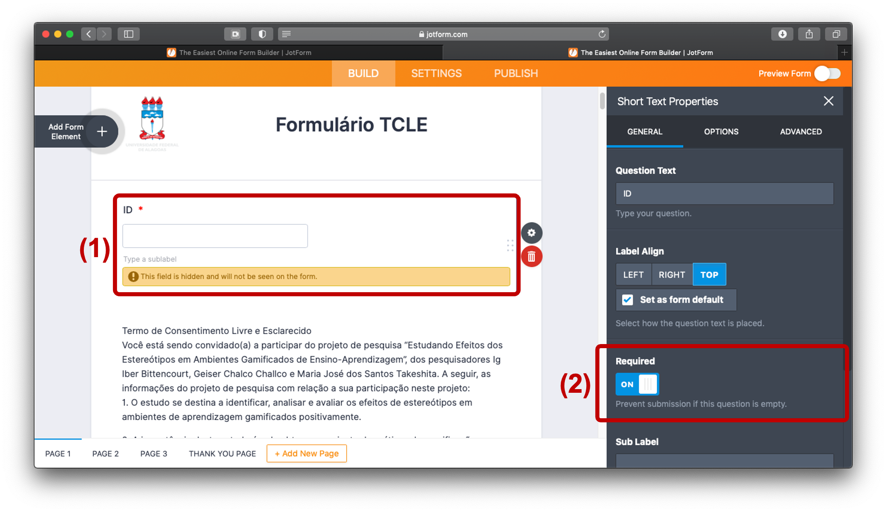
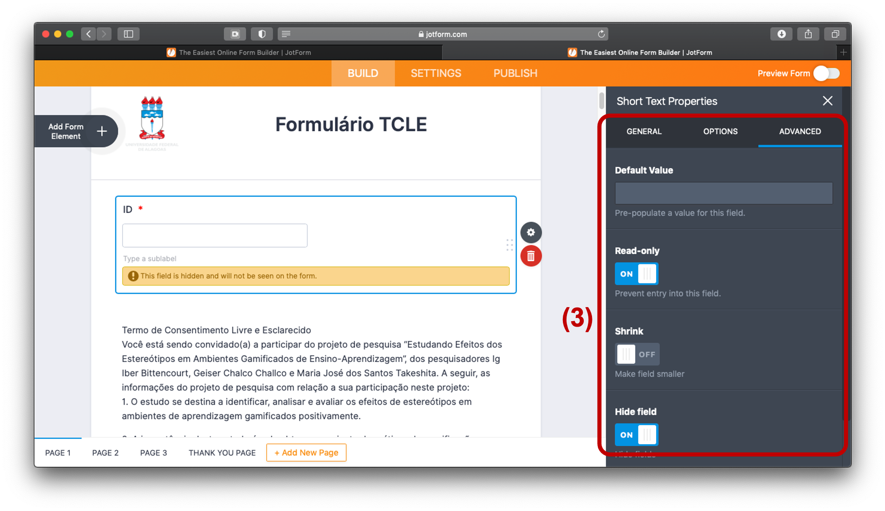
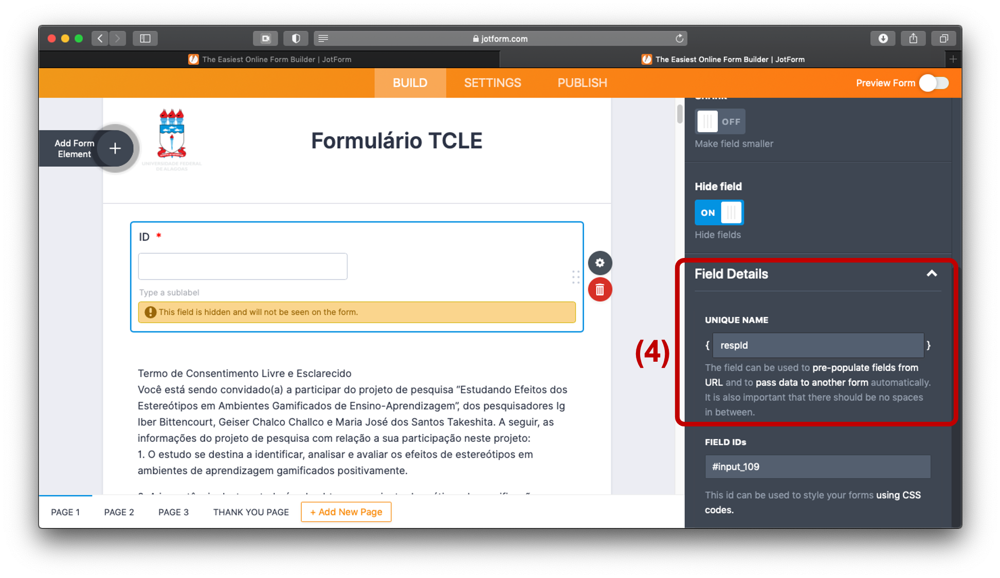
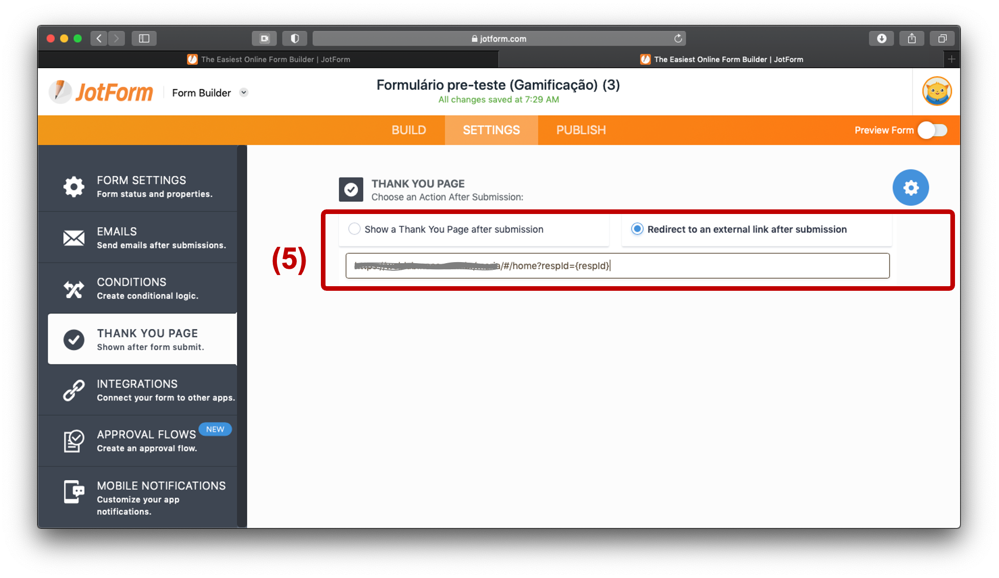
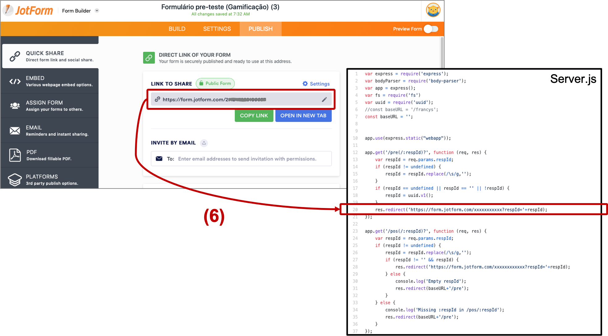
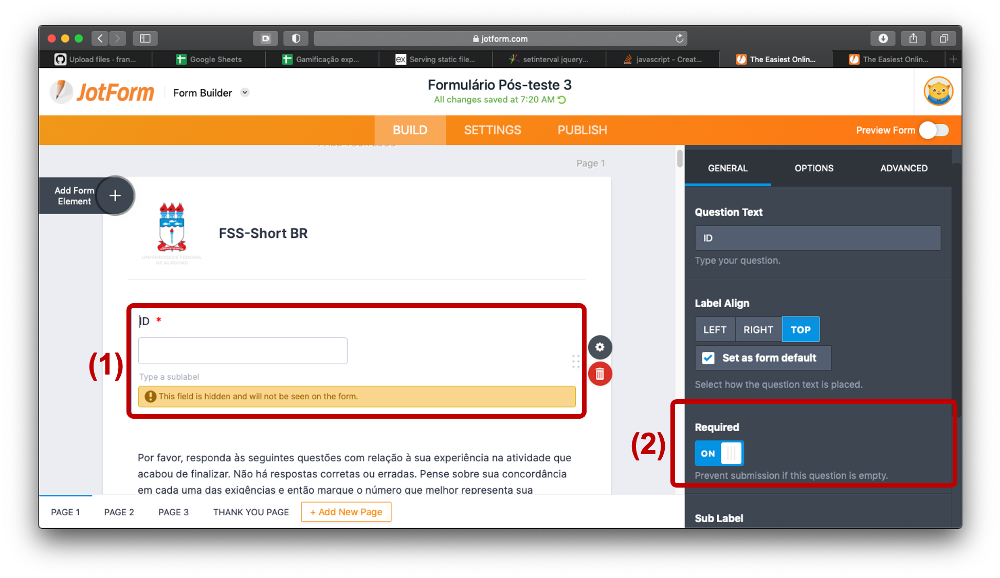
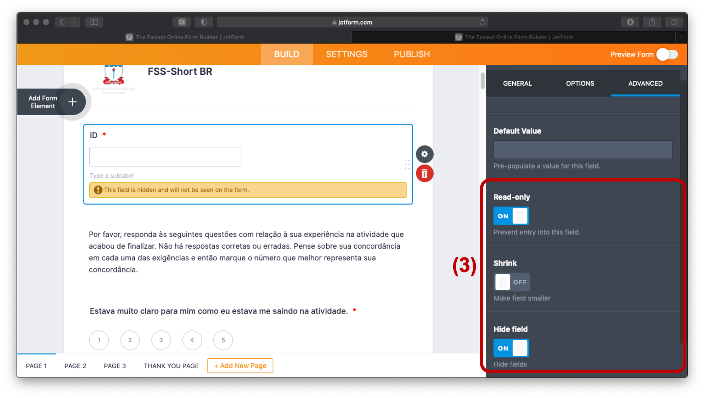
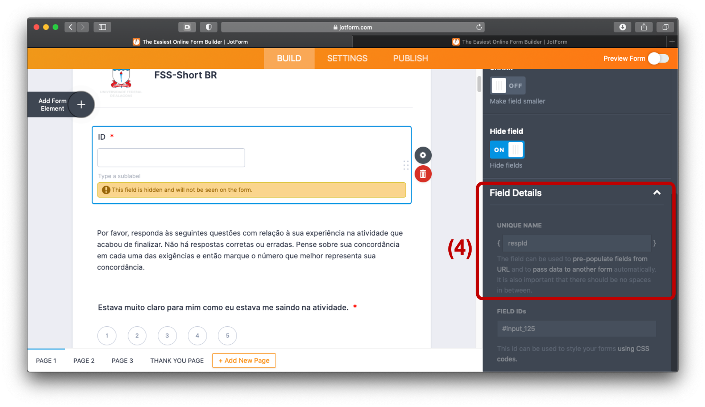
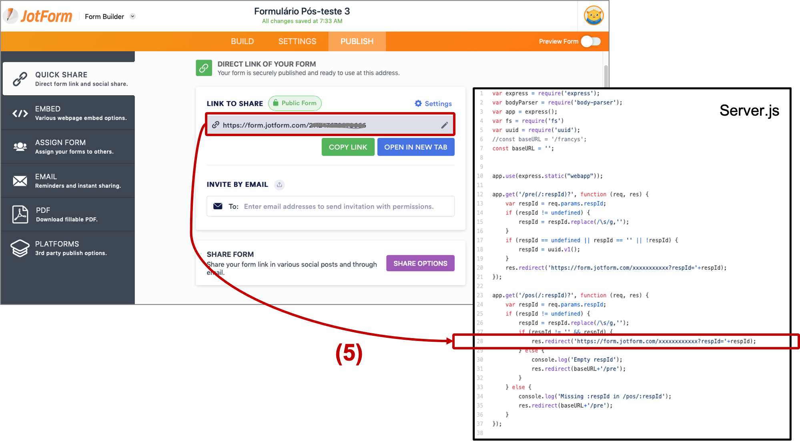

## Gender stereotypes, student anxiety, and gamification


This repository contains the code for the experiment described in the article, "[Does gender stereotype threat in gamified educational environments cause anxiety? An experimental study](https://www.sciencedirect.com/science/article/abs/pii/S0360131517301914)."

### How to cite
* Albuquerque, J., Bittencourt, I. I., Coelho, J. A., & Silva, A. P. (2017). Does gender stereotype threat in gamified educational environments cause anxiety? An experimental study. Computers & Education, 115, 161-170.
* Bibtex:
```
@article{albuquerque2017does,
	title = "Does gender stereotype threat in gamified educational environments cause anxiety? An experimental study",
	journal = "Computers & Education",
	volume = "115",
	pages = "161 - 170",
	year = "2017",
	issn = "0360-1315",
	doi = "https://doi.org/10.1016/j.compedu.2017.08.005",
	url = "http://www.sciencedirect.com/science/article/pii/S0360131517301914",
	author = "Josmario Albuquerque and Ig I. Bittencourt and Jorge A.P.M. Coelho and Alan P. Silva",
	keywords = "Gender studies, Anxiety, Stereotype threat, Gamification in education",
}
```

## Overview
This project comprises an experimental environment to study the impact of gender stereotype threat on student anxiety. In summary, the application has the following workflow:
1. Consent form
2. Pre-test (anxiety assessment)
3. Gamified activity. There are three different design flavours for this activity: male-stereotyped, female-stereotyped, and neutral. Upon finishing the pre-test, one of the three flavours is randomly selected for the current participant. Please note the activity content does not change across versions (only UI elements like colours and images).
4. Post-test (anxiety assessment, same as the pre-test).


## Getting started

In order to setup this project for a real use in your research, you will need to follow two basic steps: (1) adapt the project for your research needs; and (2) actual run the project. If you just want to see how it looks like, you can go straight to step 2 and run the project locally.  

### Step 1: Adapting the project for your needs

* In general, most textual content can be changed by editing the '*.html' files located in:
	* `webapp/views/`
* For server configurations and where the responses are submited, refer to:
	* `Server.js` - port 
* For changing the baseURL refer to the files:
    * `server.js` - const `baseURL`
    * `webapp/services.js`  - const `baseURL`

### Step 3: Running the project
A simple way to run this project is:

1. Make sure [Node.js](https://nodejs.org/) is installed
2. Go to the project directory
2. Install the dependencies:
```
npm install
```
3. Run the project:
```
npm start
```

## Guide

### Setting the pre-test questionnaire











### Setting the pos-test questionnaire










### Frameworks
This project was made using the following frameworks:

* AngularJS
	* [Documentation](https://material.angularjs.org/latest/)
* Express.js
	* [Documentation](https://expressjs.com/en/4x/api.html)
